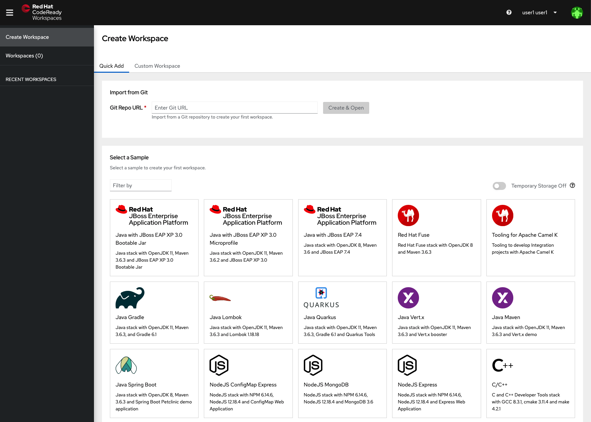
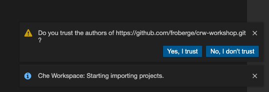
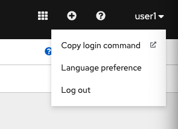

# Installation du cli d’OpenShift

Grâce à l'interface de ligne de commande (CLI) il est possible de créer des applications et gérer les projets de la plateforme `OpenShift` à partir d'un terminal.  Le cli d’OpenShift est idéal dans certaines situations:
* Pour travailler directement avec le code source du projet
* Rouler des scripts sur la plateforme `OpenShift`
* Pour faire des actions qui ne sont pas accessibles dans la console Web.

Dans le cadre de l’atelier nous proposons 2 façons d'installer le CLI de OpenShift.
1. [Installation sur son ordinateur](#option-1)
2. [Installation dans CodeReady Workspace](#option2)
---

## Option 1

Installez-l’`OpenShit CLI` sur sa machine locale, suivre les étapes suivantes.

1. [Télécharger](https://mirror.openshift.com/pub/openshift-v4/clients/ocp/) 

2. Sélectionner la version d’OpenShift et du client qui représente systçme d’exploitation.*ex: ocp4.8.18->openshidt-client-mac* 

3. Dans un terminal, ouvrir l'archive
```
$ tar zvzf <file>
```

4. Mettre binaire `oc` dans le `PATH`
```
echo $PATH
```

5.  Un fois terminé vous devriez pouvoir executer des commandes `oc`
```
oc version
```

Example de résultat
```
Client Version: 4.7.0-202103010125.p0-c66c03f
Server Version: 4.8.15
Kubernetes Version: v1.21.1+a620f50
```

## Option 2

Installer le `OpenShift CLI` sur CodeReady Workspace.

1. À partir de l'onglet `Create Worspace`

    

2. Dans le champ `Git Repo URL` mettre le url suivant et cliquer sur `Create & Open`
    ```
    https://github.com/froberge/crw-registry/tree/main/devfiles/ocp-cli-4.8
    ```
    

    CodeReady Workspace va maintenant procéder avec la création du workspace.
    

3. Clicker sur `Yes, I Trust`

    

4. Clicker sur `Restart`

    

5. On peut maintenant démarrer un terminal.


### Connecter à OpenShift avec le cli

1. À partir de la console web d’OpenShift allez dans l'option `Copy login command`        


2. Display Token

3. Copier la ligne sous `Log in with this token`


4. Coller la ligne dans le terminal.

5. Voici un example de résultat.


:tada: FÉLICITATION

Vous avez installé le CLI et vous vous êtes connecté à Openshift en ligne de commande.


:point_right: Suivant: [Authentication à GitHub](docs/github-private.md)
