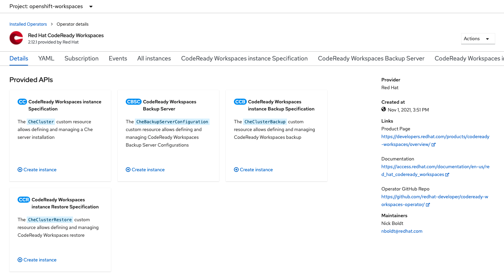
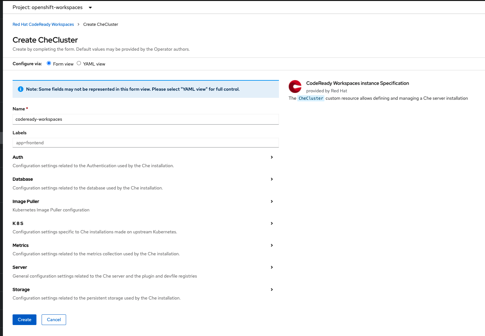
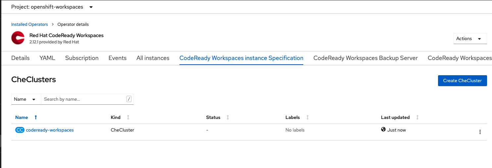

# Créer un instance de CodeReady Workspace.

Maintenant que l'opérateur est installé, installons le cluster pour CodeReady Workspace.

## Étapes:

Allons dans le tab `Operator -> Installed Operators`, comme suit:

Clicker sur opérateur Red Hat CodeReady Workspace pour l'ouvrir:

Dans la section `Details`, sous `Code Ready Workspace instance Specification` clicker sur Create instance.

Laissons toute les valeurs par default et clicker sur `Create`

OpenShift commencera la création du `CheCluster`.  Clicker sur le cluster qui vient d'être créer pour voir les détails.

`CodeReady Workspace` est prêt une fois que le `CodeReady Workspace URL` apparait.

:tada: FÉLICITATION

Vous avez construit l'instance du CodeReady Workspace requis pour sont utilisations. Vous pouvez maintenant partager le URL avec vos utilisateur. Leur environnement sera créé lors de leur première connection.

 :point_right: Suivant: [Connection d'un utilisateur](user-connection.md)