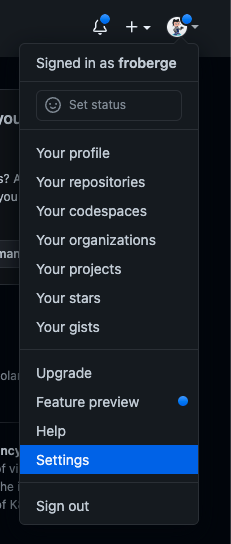

# Configurer un accèes à un repository GitHub privé

Il es possible de connecter CodeReady workspace vers des repository Github qui sont privé avec utilisation d'une [token personnel](https://docs.github.com/en/authentication/keeping-your-account-and-data-secure/creating-a-personal-access-token) sur github. 

### Prerequis
* Être connecté à la console web de `OpenShift` en temps qu'administrateur du cluster.
* Avoir un compte GitHub

### Créer la `token personnel` sur Github.

## Créer Application Auth côté GitHub

1. À partir de votre compte [Github](github.com), sous votre profile, selectionnez `setting`.


5. Selectionné `Developer settings`


6. Selectionné `Personal access tokens`


7. Clicker sur `Generate new token`et entrer les info.


* `Note`: Le nom pour la token
* `Expiration`: Choisir l'expiration requise pour vos critère de sécurité. 
*  `Select scopes`: Doit sélectionné repo au minimum
* Clicker `Generate token`

:warning: Copier la token qui vient d'être généré car elle ne sera plus accessible.


## Créer les secrets dans OpenShift
:warning: Cette étape peut-être fait qu'un fois que l'utilisateur c'est connecté a CodeReady workspace une première fois.

### Étapes:

1. Se à `OpenShift` avec le  `cli OpenShift`

2. Allez dans le project qui contient le CodeReady workspace. Le nom du projet devrait ressemble a quelques chose du genre:  'username'-codeready
```
oc project <your_project_name>
```

3. Créer le nouveau `Secret`. Pour ce faire nous devons utiliser la token fait dans github plus tôt.

```
oc create secret generic git-credentials-secret --from-literal=credentials=https://<GITHUB_USER>:<PERSONAL_TOKEN>@github.com
```

4. Une fois le secret terminer nous devons annoter le secret comme suit:
```
oc annotate secret git-credentials-secret \
che.eclipse.org/automount-workspace-secret='true' \
che.eclipse.org/mount-path=/home/theia/.git-credentials \
che.eclipse.org/mount-as=file \
che.eclipse.org/git-credential='true'
```

5. Pour terminer, créons un `label secret`
```
oc label secret git-credentials-secret \
app.kubernetes.io/part-of=che.eclipse.org \
app.kubernetes.io/component=workspace-secret
```

:tada: FÉLICITATION

Vous avez connectez a un repository privé sur GitHub.
