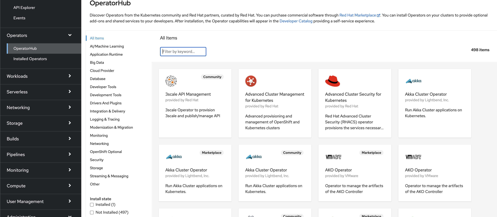
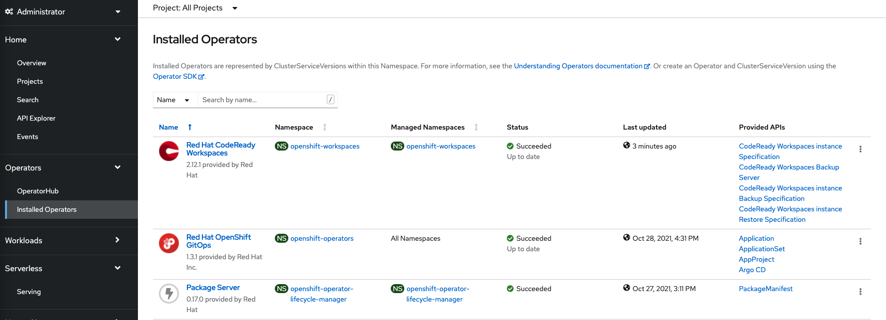

# Installer CodeReady Workspace

CodeReady workspace est fourni comme un "add-on" dans OpenShift. Il peut-être installé par un opérateur que l'ont trouve dans le Operator Hub de Openshift.

## Étapes:

#### Étape 1:
Se connecter à OpenShift avec un utilisateur qui à les droits administrateur sur le cluster. 

Un fois connecté, on devrait voir la perpective suivante:

#### Étape 2:
Allez dans la section operator dans le Operator Hub, `Operators -> OperatorHub`. 

On trouve ici la liste de tous les opérateurs accessible pour OpenShift fourni par Red Hat, autant ceux de la communauté que ceux des partenaires:

Pour facilité le processus, dans le champs `Filter by keyword...`, entrons la valeur suivante: `CodeReady`

Sélectionner l'opérateur CodeReaddy Workspace pour démarrer l'installation. Laissez tout les valeur par défault et clicker sur start.

Une fois l'installation terminé, on devrait voir opérator Red Hat CodeReady Workspace dans le tab `Operator -> Installed Operators`, comme suit:

:tada: FÉLICITATION

L'opérateur Red Hat CodeReady Workspaces est maintainenat installé sur le cluster.

 :point_right: Suivant: [Création de instance CodeReady Workspace](create-crw-workspace.md)