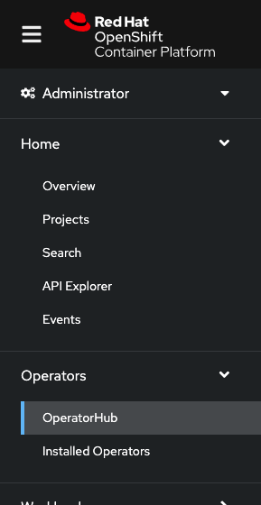

# Installer CodeReady Workspace

CodeReady workspace est un "add-on" pour OpenShift. Il est installé par un opérateur que l'on trouve dans le Operator Hub de d’Openshift.

## Étapes d’installation:

#### Étape 1:
Se connecter à OpenShift avec un utilisateur qui à les droits administrateur sur le cluster. 

Une fois connectée, on devrait voir la perspective suivante:

#### Étape 2:
Allez dans la section operator dans le Operator Hub, `Operators -> OperatorHub`. 

On trouve ici la liste de tous les opérateurs accessible pour OpenShift fournie par Red Hat, autant ceux de la communauté que ceux des partenaires:

Pour simplifier le processus, dans le champ `Filter by keyword...`, mettre la valeur suivante: `CodeReady`

Sélectionner l'opérateur CodeReaddy Workspace pour démarrer l'installation. Laissez toutes les valeurs par défaut et cliquez sur start.

Une fois l'installation terminée, on devrait voir opérateur Red Hat CodeReady Workspace dans le tab `Operator -> Installed Operators`, comme suit:

:tada: FÉLICITATION

L'opérateur Red Hat CodeReady Workspaces est maintenant installé dans le cluster d’OpenShift.

:point_right: Suivant: [Création d’une instance CodeReady Workspace](create-crw-workspace.md)
