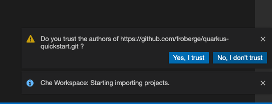

# Creation d'un workspace à partir d'un repository GitHub.

Pour facilité la collaboration au niveau du code et permettre au développeur d'être fonctionnel en quelque minutes, il est possible de créer un nouveau workspace au niveau de CodeReady Workspace à partir d'un repository GitHub.

### Prérequis.
* Avoir un compte Github, et avoir effectué les [étapes de connection à github](docs/github-private.md).
* Avoir un [DevFile](https://devfile.io/docs/devfile/2.1.0/user-guide/index.html) au niveau du répository.


### Étapes
1. A partir de l'onglet `Create Worspace`


2. Dans le champs `Git Repo URL` mettre le url suivant et clicker sur `Create & Open`
```
https://github.com/froberge/quarkus-quickstart/
```


CodeReady Workspace va maintenant procéder avec la création du workspace et le clone du code.


3. Clicker sur `Yes, I Trust`


4. Clicker sur `Restart`


5. On peut maintenant partir un terminal.


:tada: FÉLICITATION

La première application a été cloner dans CodeReady Workspace, on peut maintenant commencé a travailler.